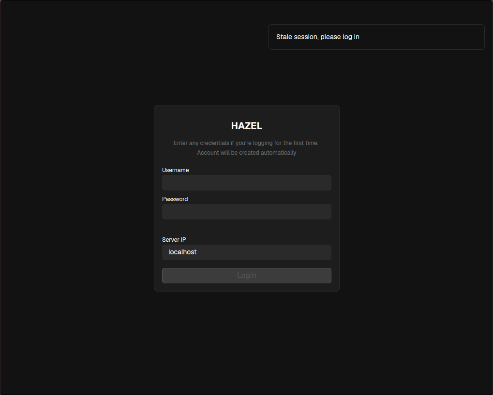
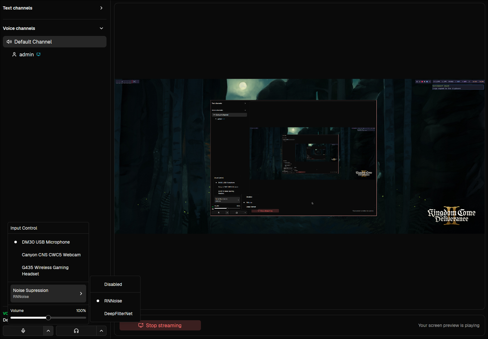

# HAZEL

Modern VoIP software with snappy UI and self-hosting capabilities.

**Client dependencies:**

- pipewire (linux only)

**Supported operating systems**

- Linux
- Windows

## AI Notice

100% of the code in this repository is typed by a human using this keyboard: https://github.com/ergohaven/hpd :D
If you plan to contribute to this project, AI is strictly forbidden for code generation (research is fine, though).

## Project status

The project is under active development and should be considered alpha.
It's already fully usable for audio conversations (Linux/Windows) and screen sharing (Linux only, for now).

My friends and I are using it daily for our evening gaming sessions.

## Goals

The goal is to create an open-source, self-hostable alternative to Discord with a strong focus on performance and low-latency audio and video.

# UI Screenshots

## Login Screen

## Main Screen

